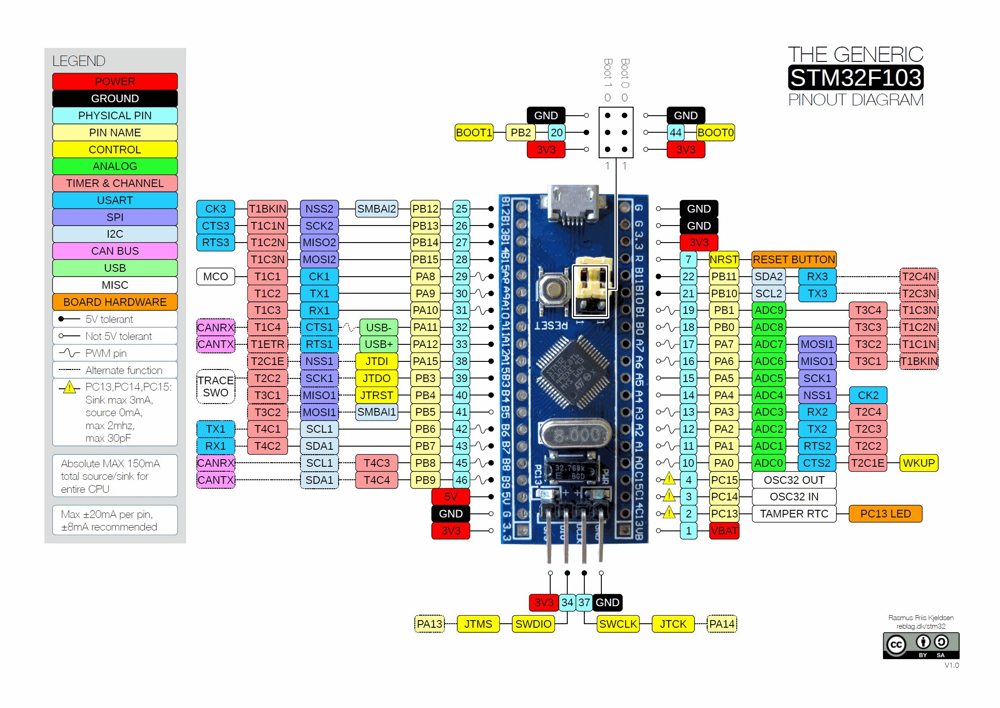

# STM32 BluePill in Rust - Project template
The updated project template that I use for BluePill micro-controller in Rust.

## BluePill STM32F103 - Development board

This is my starting point to make a project with the BluePill in Rust. It was made by following the following 3 github repository notes and files and modifying them to update them, following video playlist and the 2 books of embedded Rust. Those modifications take care of my present needs in term of STM32 BluePill development in Rust<br>
<br>



## Specifications:

* STM32F103C8T6 ARM Cortex M3
* 72MHz, 90 DMIPS / 1.25 DMIPS / MHz
* 2.0V - 3.6V operating voltage
* 8MHz system crystal
* 32.768KHz RTC crystal
* 2.54mm pitch pins
* JTAG/SWD header
* 64 KByte Flash, 20 KByte SRAM
* 2x SPI, 3x USART, 2x I2C, 1x CAN
* 38 I/Os almost all 5V-tolerant
* 1x USB 2.0 FS
* 2x ADC (12-bit / 16-channel)
* 3x general timers, 1x advanced timer
* RT9193 3.3V LDO voltage regulator, max current 300mA
* Micro USB for power and data
* Blue user LED (PC13)
* 2x jumpers for bootloader selection
* Reset button
* 2x20 side pins + 1x4 SWD pins
* Dimensions: 53.0mm x 22.5mm


## IMPORTANTE note

```
  MAX Absolute 150 mA total source/sink for entire CPU.
  
  MAX 20 mA per pin, 8mA recomended.
  
  There are pins that are 5 V tolerant but there are many that are not,
  see the diagrams of the chip and the specifications on the data chip.

  The max current at 3.3V is not equal in all the pins, 
     PC13, PC14 e PC15 are weaker pins Source 0 mA e sink 3 mA max 2 MHz e max 30pF.
```   


## Connecting the STM32 Blue Pill to ST-Link V2 USB Debugger

```
STM32 Blue Pill        ST-Link V2 USB Debugger
V3      [Red]         3.3V     (Pin 8)
IO      [Orange]      SWDIO    (Pin 4)
CLK     [Brown]       SWDCLK   (Pin 2)
GND     [Black]       GND      (Pin 6)
```


## Good references

1. **stm32f1xx-hal in Rust** <br>
   [https://github.com/stm32-rs/stm32f1xx-hal](https://github.com/stm32-rs/stm32f1xx-hal)

2. **stm32-rs - stm32f1xx-hal - Examples** <br>
   [https://github.com/stm32-rs/stm32f1xx-hal/tree/master/examples](https://github.com/stm32-rs/stm32f1xx-hal/tree/master/examples)

3. **Video Play List - Embedded Rust BluePill** <br>
   [https://www.youtube.com/playlist?list=PLP_X41VhYn5X6Wwjnm0bRwI3n2pdaszxU](https://www.youtube.com/playlist?list=PLP_X41VhYn5X6Wwjnm0bRwI3n2pdaszxU)

4. **TeXitoi - blue-pill-quickstart** <br>
   The Example source code is modified from here. <br>
   [https://github.com/TeXitoi/blue-pill-quickstart](https://github.com/TeXitoi/blue-pill-quickstart)

5. **lupyuen - stm32-blue-pill-rust** <br>
   This uses debugger multi architecture and VSCode. <br>
   [https://github.com/lupyuen/stm32-blue-pill-rust](https://github.com/lupyuen/stm32-blue-pill-rust)

6. **rust-embedded - cortex-m-quickstart** <br>
   [https://github.com/rust-embedded/cortex-m-quickstart](https://github.com/rust-embedded/cortex-m-quickstart)

7. **STM32 - Discovery - Book** <br>
   [https://docs.rust-embedded.org/discovery/](https://docs.rust-embedded.org/discovery/)

8. **The Embedded Rust Book** <br>
   [https://docs.rust-embedded.org/book/](https://docs.rust-embedded.org/book/)

9. **229 drivers para Embedded-HAL** <br>
   [https://crates.io/keywords/embedded-hal-driver](https://crates.io/keywords/embedded-hal-driver)

10. **Awesome Embedded Rust** <br>
    [https://github.com/rust-embedded/awesome-embedded-rust](https://github.com/rust-embedded/awesome-embedded-rust)

11. **How to learn modern Rust** <br>
    [https://github.com/joaocarvalhoopen/How_to_learn_modern_Rust](https://github.com/joaocarvalhoopen/How_to_learn_modern_Rust)
    

## After installation in process to compile, flash and debug you only need to do

```
######
# Window CMD 1
$ openocd

# Windows CMD 2
$ cargo clean
$ cargo build
$ cargo run

or just do: 

######
# Window CMD 1
$ openocd

# Window CMD 2
$ cargo build
$ cargo run

or

(gdb) continue

or

(gdb) ctrl + c
(gdb) list

or
(gdb) ctrl + c
(gdb) layout src

######
Or inside VSCode in a debug sectiondo,

# Window CMD 1
$ openocd

Just put one breakpoint and start running the Debug play icon. 
(VSCode) Set Breakpoint in line 10.
(VSCode) icon play debug.
```

## Installation of embedded Rust for STM32

**After installing Rust on you PC do:** <br>

```
$ rustup update
$ rustc --version

$ rustup target add thumbv7m-none-eabi
```

Installation of the debugger (**gdb-multiarch**) and the tool to flash do chip, the onm circuit debugger SWD (**openocd**): <br>

```
(arm-none-eabi-gdb is obsolete, we will use gdb-multiarch)

$ sudo apt-get install  gdb-multiarch openocd

$ sudo ln -s /usr/bin/gdb-multiarch /usr/bin/arm-none-eabi-gdb
```

Install **ARM Cross-Compiler** and **Linker** <br>

```
$ sudo apt install binutils-arm-none-eabi gcc-arm-none-eabi

$ arm-none-eabi-gcc -v
```

It should appear something like this: <br>

```
"version 9.2.1 20191025 (release)"
```

If not you have a problem in the path: <br>

1. If you see no errors, close the command prompt.

2. If you see an error, update your PATH environment variable so that it includes the folder for the ARM ".exe" files.


## How to use this repository

```
1. Download the repository or clone it to a directory.
2. Change the directory name from "stm32_bluepill_in_rust__Template"
   to "stm32_bluepill_in_rust".
3. Connect the BluePill ST-Link_V2 programmer to the Blupill and to
   the computer, only the programmer can be connected while programming.
3. Then do:

Window CMD 1
$ cd stm32_bluepill_in_rust
$ openocd

Window CMD 2
$ cd stm32_bluepill_in_rust
$ cargo clean
$ cargo build
$ cargo run
```

Then **to do your own project** you will have to create a project directory with the name of the project (lowercase and "_"), then copy the all the files there, then change the files where is "**stm32_bluepill_in_rust**" to your project name. <br>
**The files to change are:** <br>
* openocd.gdb
* launch.json


## License
MIT Open Source license. <br>
This are very basic configuration files and a simple blink example that I made by updating and modifying the upper referenced links. This is just my starting point for a project with the bluepill in Rust.


## Have fun!
Best regards, <br>
João Nuno Carvalho <br>

